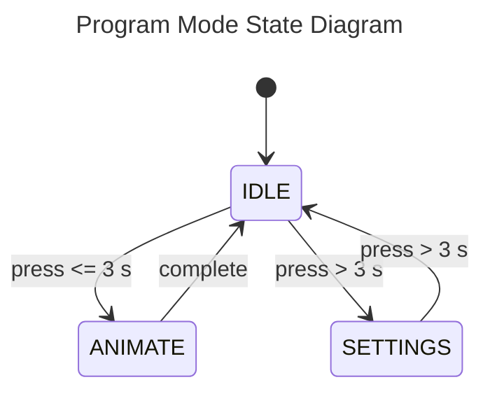

# Pumpkin Bomb
This code powers light animations, and sound for a Pumpkin Bomb prop replica.

## Components
* [Teensy 2](https://www.pjrc.com/store/teensy.html) x 1
* [NeoPixel Ring](https://www.adafruit.com/product/1643) x 2
* White LEDs x 8
* Momentary Switch x 1

## Modes
The program has three modes

### IDLE
This mode waits for various lengths of button presses.  If hold is < 3 seconds, it will trigger the default 
animation, extending it's length based on how long the button was held. If hold is > 3 seconds, program will
enter SETTINGS mode.

### ANIMATE
This mode will run the current animation to completion, at which point it will return to IDLE mode.

### SETTINGS
This mode will interpret button presses as settings changes until held for > 3 seconds, at which point it will
return to IDLE mode.

